# Сценарии бота — Стеклянные перегородки

Полный перечень всех сценариев, реализованных в Telegram-боте управления проектами по установке стеклянных перегородок.

---

## Оглавление

1. [Общая схема жизненного цикла проекта](#1-общая-схема-жизненного-цикла-проекта)
2. [Менеджер](#2-менеджер)
3. [РП — Руководитель проектов](#3-рп--руководитель-проектов)
4. [ТД — Технический директор](#4-тд--технический-директор)
5. [Бухгалтерия](#5-бухгалтерия)
6. [Монтажник](#6-монтажник)
7. [Водитель](#7-водитель)
8. [Тонировщик](#8-тонировщик)
9. [ГД — Генеральный директор](#9-гд--генеральный-директор)
10. [Лиды из amoCRM](#10-лиды-из-amocrm)
11. [Универсальные действия с задачами](#11-универсальные-действия-с-задачами)
12. [Фоновые сервисы](#12-фоновые-сервисы)
13. [Админ-команды](#13-админ-команды)
14. [Общие команды](#14-общие-команды)

---

## 1. Общая схема жизненного цикла проекта

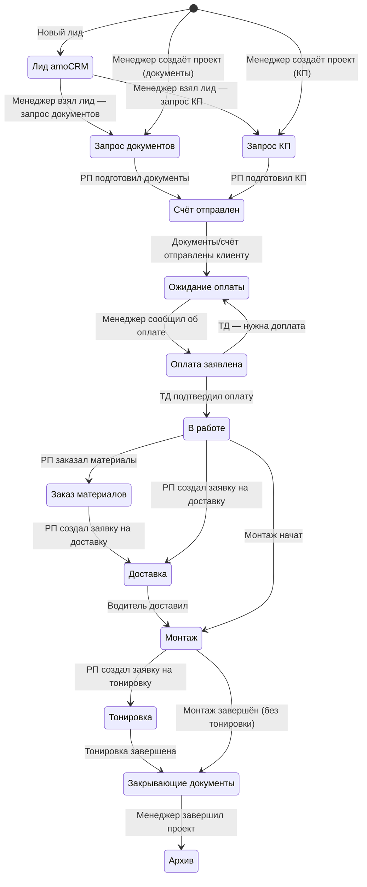
```mermaid
stateDiagram-v2
    state "Лид amoCRM" as s0
    state "Запрос документов" as s1
    state "Запрос КП" as s2
    state "Счёт отправлен" as s3
    state "Ожидание оплаты" as s4
    state "Оплата заявлена" as s5
    state "В работе" as s6
    state "Заказ материалов" as s7
    state "Доставка" as s8
    state "Монтаж" as s9
    state "Тонировка" as s10
    state "Закрывающие документы" as s11
    state "Архив" as s12

    [*] --> s0 : Новый лид
    s0 --> s1 : Менеджер взял лид — запрос документов
    s0 --> s2 : Менеджер взял лид — запрос КП

    [*] --> s1 : Менеджер создаёт проект (документы)
    [*] --> s2 : Менеджер создаёт проект (КП)

    s1 --> s3 : РП подготовил документы
    s2 --> s3 : РП подготовил КП

    s3 --> s4 : Документы/счёт отправлены клиенту
    s4 --> s5 : Менеджер сообщил об оплате
    s5 --> s6 : ТД подтвердил оплату
    s5 --> s4 : ТД — нужна доплата

    s6 --> s7 : РП заказал материалы
    s7 --> s8 : РП создал заявку на доставку
    s6 --> s8 : РП создал заявку на доставку
    s8 --> s9 : Водитель доставил
    s6 --> s9 : Монтаж начат
    s9 --> s10 : РП создал заявку на тонировку
    s10 --> s11 : Тонировка завершена
    s9 --> s11 : Монтаж завершён (без тонировки)
    s11 --> s12 : Менеджер завершил проект
```

---

## 2. Менеджер

Роль: «Менеджер» | Паша и другие менеджеры по продажам.

### 2.1 Запрос документов / счёта

**Триггер:** Кнопка «Проверить КП/Запросить документы» или `/docs`

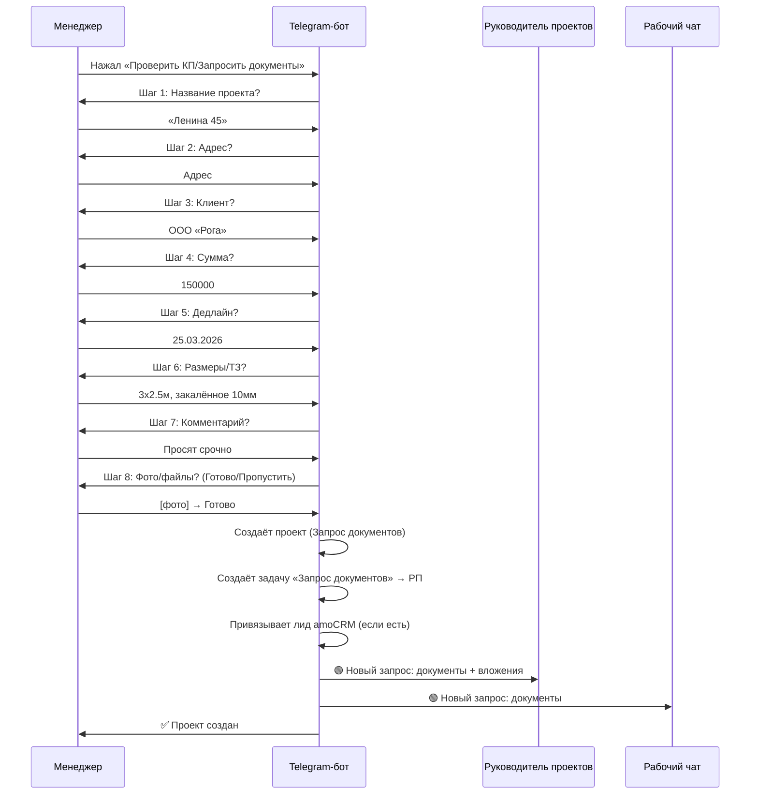
```mermaid
sequenceDiagram
    participant М as Менеджер
    participant Бот as Telegram-бот
    participant РП as Руководитель проектов
    participant Чат as Рабочий чат

    М->>Бот: Нажал «Проверить КП/Запросить документы»
    Бот->>М: Шаг 1: Название проекта?
    М->>Бот: «Ленина 45»
    Бот->>М: Шаг 2: Адрес?
    М->>Бот: Адрес
    Бот->>М: Шаг 3: Клиент?
    М->>Бот: ООО «Рога»
    Бот->>М: Шаг 4: Сумма?
    М->>Бот: 150000
    Бот->>М: Шаг 5: Дедлайн?
    М->>Бот: 25.03.2026
    Бот->>М: Шаг 6: Размеры/ТЗ?
    М->>Бот: 3x2.5м, закалённое 10мм
    Бот->>М: Шаг 7: Комментарий?
    М->>Бот: Просят срочно
    Бот->>М: Шаг 8: Фото/файлы? (Готово/Пропустить)
    М->>Бот: [фото] → Готово

    Бот->>Бот: Создаёт проект (Запрос документов)
    Бот->>Бот: Создаёт задачу «Запрос документов» → РП
    Бот->>Бот: Привязывает лид amoCRM (если есть)
    Бот->>РП: 🟢 Новый запрос: документы + вложения
    Бот->>Чат: 🟢 Новый запрос: документы
    Бот->>М: ✅ Проект создан
```

**Создаётся:** Проект (статус «Запрос документов»), Задача («Запрос документов», назначена РП, дедлайн 24ч).
**Уведомления:** РП (личное + вложения), Рабочий чат.
**amoCRM:** Если у менеджера есть невыкупленный лид — привязывается к проекту. Иначе создаётся новый лид.

---

### 2.2 Запрос КП

**Триггер:** Кнопка «➕ Запросить / КП /» или `/kp`

Аналогичен сценарию 2.1, но без поля «Сумма». Проект создаётся со статусом «Запрос КП», задача типа «Запрос КП».

---

### 2.3 Оплата поступила

**Триггер:** Кнопка «💰 Оплата поступила» в меню проекта

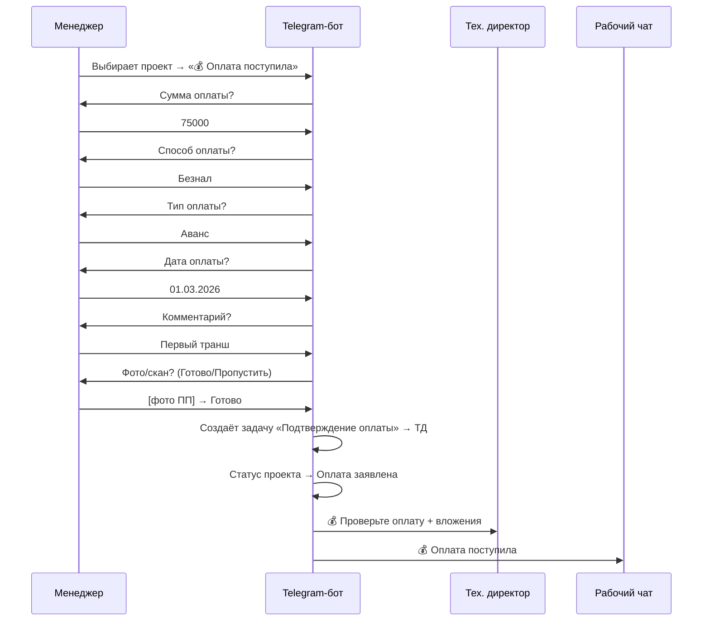
```mermaid
sequenceDiagram
    participant М as Менеджер
    participant Бот as Telegram-бот
    participant ТД as Тех. директор
    participant Чат as Рабочий чат

    М->>Бот: Выбирает проект → «💰 Оплата поступила»
    Бот->>М: Сумма оплаты?
    М->>Бот: 75000
    Бот->>М: Способ оплаты?
    М->>Бот: Безнал
    Бот->>М: Тип оплаты?
    М->>Бот: Аванс
    Бот->>М: Дата оплаты?
    М->>Бот: 01.03.2026
    Бот->>М: Комментарий?
    М->>Бот: Первый транш
    Бот->>М: Фото/скан? (Готово/Пропустить)
    М->>Бот: [фото ПП] → Готово

    Бот->>Бот: Создаёт задачу «Подтверждение оплаты» → ТД
    Бот->>Бот: Статус проекта → Оплата заявлена
    Бот->>ТД: 💰 Проверьте оплату + вложения
    Бот->>Чат: 💰 Оплата поступила
```

**Создаётся:** Задача «Подтверждение оплаты» (назначена ТД, дедлайн 24ч).
**Обновляется:** Проект → статус «Оплата заявлена».

---

### 2.4 Закрывающие документы

**Триггер:** Кнопка «📄 Док. / ЭДО» в меню проекта

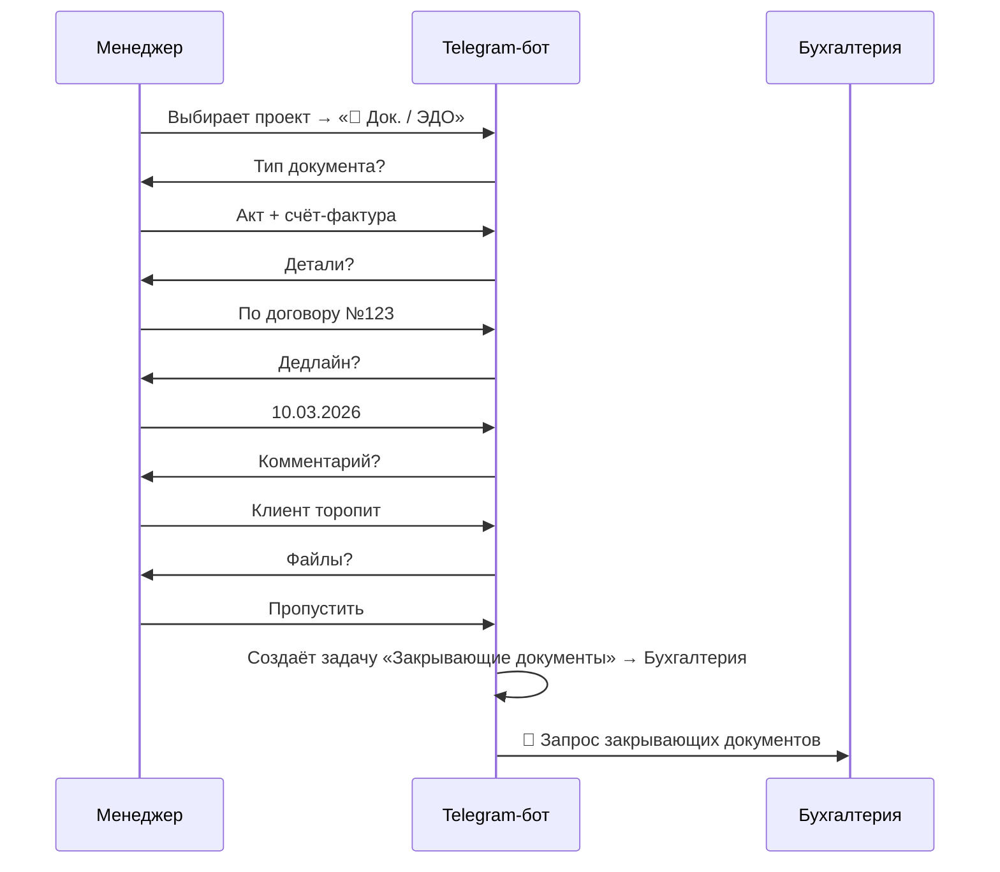
```mermaid
sequenceDiagram
    participant М as Менеджер
    participant Бот as Telegram-бот
    participant Бух as Бухгалтерия

    М->>Бот: Выбирает проект → «📄 Док. / ЭДО»
    Бот->>М: Тип документа?
    М->>Бот: Акт + счёт-фактура
    Бот->>М: Детали?
    М->>Бот: По договору №123
    Бот->>М: Дедлайн?
    М->>Бот: 10.03.2026
    Бот->>М: Комментарий?
    М->>Бот: Клиент торопит
    Бот->>М: Файлы?
    М->>Бот: Пропустить

    Бот->>Бот: Создаёт задачу «Закрывающие документы» → Бухгалтерия
    Бот->>Бух: 📄 Запрос закрывающих документов
```

**Создаётся:** Задача «Закрывающие документы» (назначена Бухгалтерии, дедлайн указанный).
**Обновляется:** Проект → статус «Закрывающие документы».

---

### 2.5 Проблема / вопрос по проекту

**Триггер:** Кнопка «🆘 Проблема / вопрос» в меню проекта

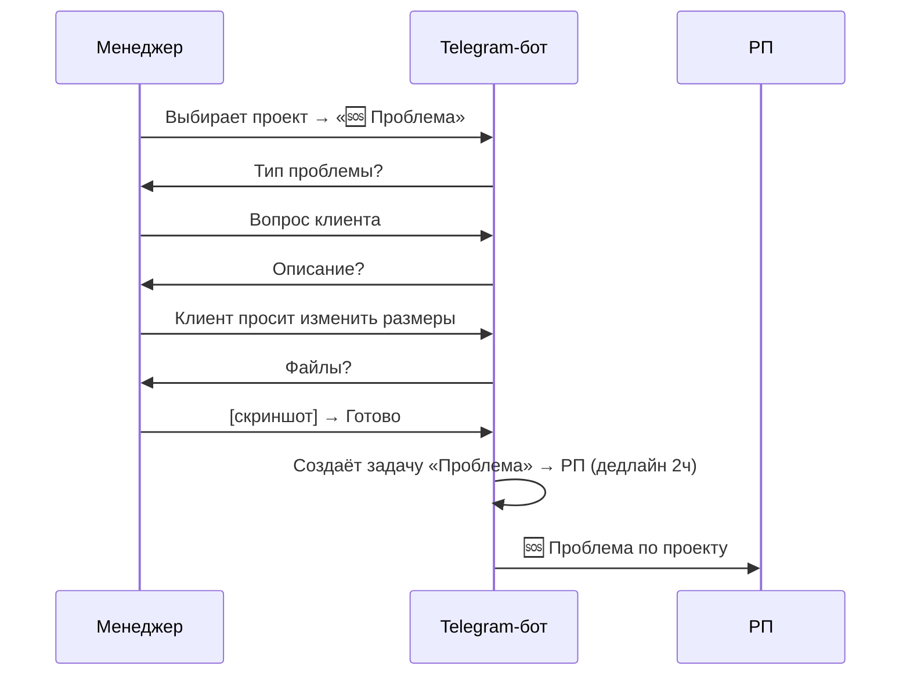
```mermaid
sequenceDiagram
    participant М as Менеджер
    participant Бот as Telegram-бот
    participant РП as РП

    М->>Бот: Выбирает проект → «🆘 Проблема»
    Бот->>М: Тип проблемы?
    М->>Бот: Вопрос клиента
    Бот->>М: Описание?
    М->>Бот: Клиент просит изменить размеры
    Бот->>М: Файлы?
    М->>Бот: [скриншот] → Готово

    Бот->>Бот: Создаёт задачу «Проблема» → РП (дедлайн 2ч)
    Бот->>РП: 🆘 Проблема по проекту
```

**Создаётся:** Задача «Проблема» (назначена РП проекта, дедлайн 2ч).

---

### 2.6 Завершение проекта

**Триггер:** Кнопка «🏁 Счёт End» в меню проекта

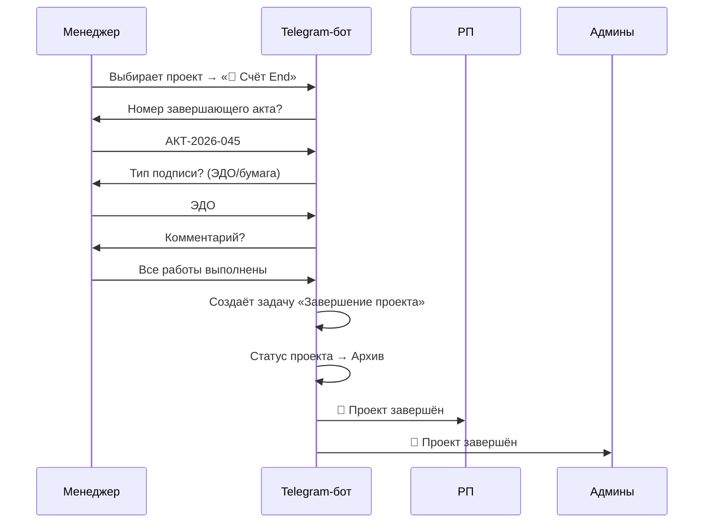
```mermaid
sequenceDiagram
    participant М as Менеджер
    participant Бот as Telegram-бот
    participant РП as РП
    participant Адм as Админы

    М->>Бот: Выбирает проект → «🏁 Счёт End»
    Бот->>М: Номер завершающего акта?
    М->>Бот: АКТ-2026-045
    Бот->>М: Тип подписи? (ЭДО/бумага)
    М->>Бот: ЭДО
    Бот->>М: Комментарий?
    М->>Бот: Все работы выполнены

    Бот->>Бот: Создаёт задачу «Завершение проекта»
    Бот->>Бот: Статус проекта → Архив
    Бот->>РП: 🏁 Проект завершён
    Бот->>Адм: 🏁 Проект завершён
```

**Создаётся:** Задача «Завершение проекта».
**Обновляется:** Проект → статус «Архив».

---

### 2.7 Срочно ГД

**Триггер:** Кнопка «🚨 Срочно ГД» или `/urgent`

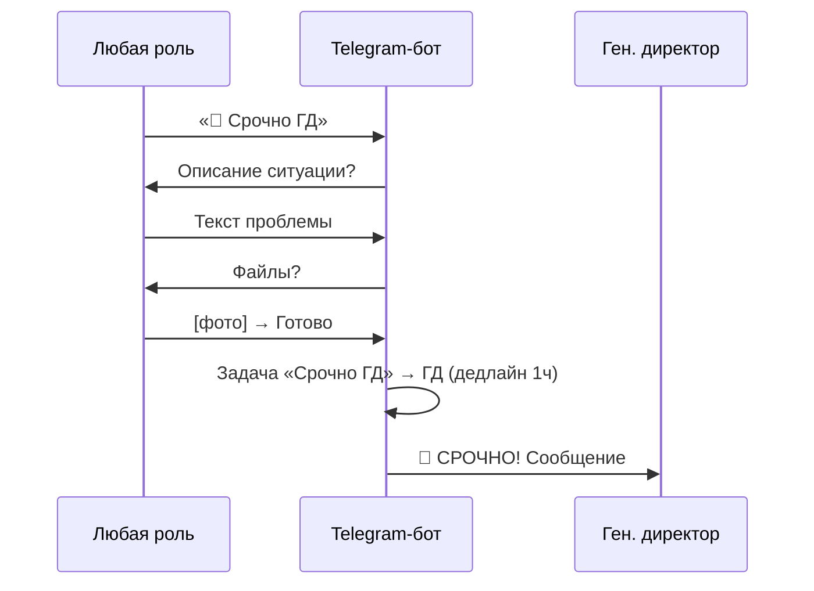
```mermaid
sequenceDiagram
    participant Любой as Любая роль
    participant Бот as Telegram-бот
    participant ГД as Ген. директор

    Любой->>Бот: «🚨 Срочно ГД»
    Бот->>Любой: Описание ситуации?
    Любой->>Бот: Текст проблемы
    Бот->>Любой: Файлы?
    Любой->>Бот: [фото] → Готово

    Бот->>Бот: Задача «Срочно ГД» → ГД (дедлайн 1ч)
    Бот->>ГД: 🚨 СРОЧНО! Сообщение
```

**Создаётся:** Задача «Срочно ГД» (дедлайн 1 час). Доступна всем ролям.

---

### 2.8 Просмотр задач и проектов

| Триггер | Описание |
|---------|----------|
| «📥 Входящие задачи» | Список задач, назначенных менеджеру (открытые / в работе) |
| «🗂 Мои проекты» | Список проектов менеджера (до 20) |
| «📌 Поиск проекта» или `/search` | Поиск по коду, названию, адресу, клиенту |

---

## 3. РП — Руководитель проектов

Роль: «РП» | Паша (руководитель проектов).

### 3.1 Заказ материалов

**Триггер:** Кнопка «📦 Заказ материалов»

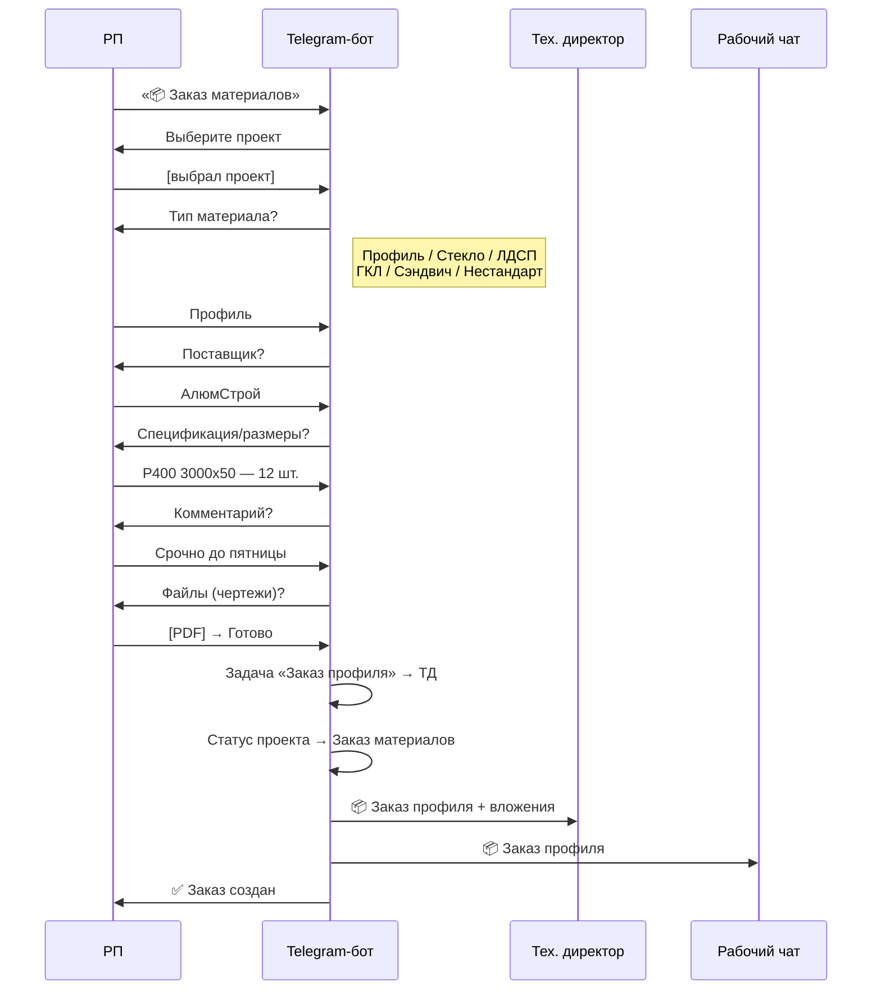
```mermaid
sequenceDiagram
    participant РП as РП
    participant Бот as Telegram-бот
    participant ТД as Тех. директор
    participant Чат as Рабочий чат

    РП->>Бот: «📦 Заказ материалов»
    Бот->>РП: Выберите проект
    РП->>Бот: [выбрал проект]
    Бот->>РП: Тип материала?
    Note right of Бот: Профиль / Стекло / ЛДСП<br/>ГКЛ / Сэндвич / Нестандарт
    РП->>Бот: Профиль
    Бот->>РП: Поставщик?
    РП->>Бот: АлюмСтрой
    Бот->>РП: Спецификация/размеры?
    РП->>Бот: P400 3000x50 — 12 шт.
    Бот->>РП: Комментарий?
    РП->>Бот: Срочно до пятницы
    Бот->>РП: Файлы (чертежи)?
    РП->>Бот: [PDF] → Готово

    Бот->>Бот: Задача «Заказ профиля» → ТД
    Бот->>Бот: Статус проекта → Заказ материалов
    Бот->>ТД: 📦 Заказ профиля + вложения
    Бот->>Чат: 📦 Заказ профиля
    Бот->>РП: ✅ Заказ создан
```

**Создаётся:** Задача «Заказ профиля» / «Заказ стекла» / «Заказ материалов» (в зависимости от типа, назначена ТД).
**Обновляется:** Проект → «Заказ материалов» (если был «В работе»).

---

### 3.2 Заявка на доставку

**Триггер:** Кнопка «🚚 Заявка на доставку»

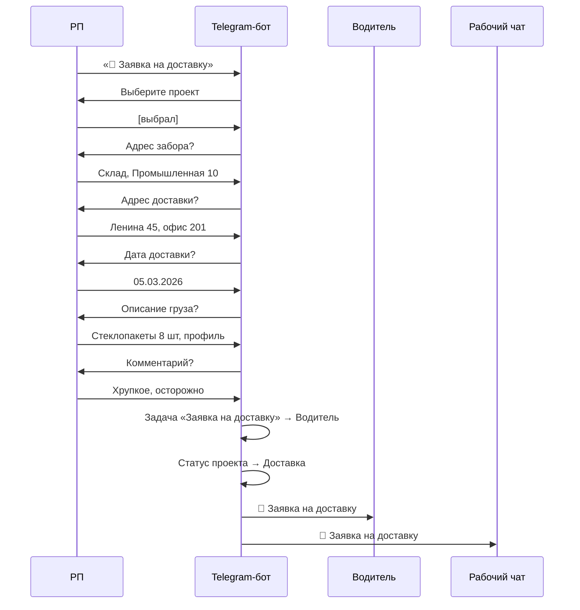
```mermaid
sequenceDiagram
    participant РП as РП
    participant Бот as Telegram-бот
    participant Вод as Водитель
    participant Чат as Рабочий чат

    РП->>Бот: «🚚 Заявка на доставку»
    Бот->>РП: Выберите проект
    РП->>Бот: [выбрал]
    Бот->>РП: Адрес забора?
    РП->>Бот: Склад, Промышленная 10
    Бот->>РП: Адрес доставки?
    РП->>Бот: Ленина 45, офис 201
    Бот->>РП: Дата доставки?
    РП->>Бот: 05.03.2026
    Бот->>РП: Описание груза?
    РП->>Бот: Стеклопакеты 8 шт, профиль
    Бот->>РП: Комментарий?
    РП->>Бот: Хрупкое, осторожно

    Бот->>Бот: Задача «Заявка на доставку» → Водитель
    Бот->>Бот: Статус проекта → Доставка
    Бот->>Вод: 🚚 Заявка на доставку
    Бот->>Чат: 🚚 Заявка на доставку
```

**Создаётся:** Задача «Заявка на доставку» (назначена Водителю).
**Обновляется:** Проект → «Доставка».

---

### 3.3 Распределение лида

**Триггер:** Кнопка «🎯 Распределить лид»

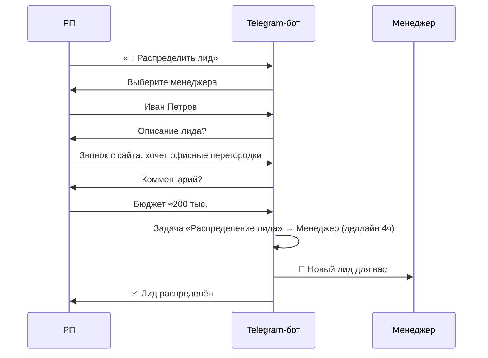
```mermaid
sequenceDiagram
    participant РП as РП
    participant Бот as Telegram-бот
    participant М as Менеджер

    РП->>Бот: «🎯 Распределить лид»
    Бот->>РП: Выберите менеджера
    РП->>Бот: Иван Петров
    Бот->>РП: Описание лида?
    РП->>Бот: Звонок с сайта, хочет офисные перегородки
    Бот->>РП: Комментарий?
    РП->>Бот: Бюджет ≈200 тыс.

    Бот->>Бот: Задача «Распределение лида» → Менеджер (дедлайн 4ч)
    Бот->>М: 🎯 Новый лид для вас
    Бот->>РП: ✅ Лид распределён
```

**Создаётся:** Задача «Распределение лида» (назначена выбранному менеджеру, дедлайн 4ч).

---

### 3.4 Заявка на тонировку

**Триггер:** Кнопка «🎨 Заявка на тонировку»

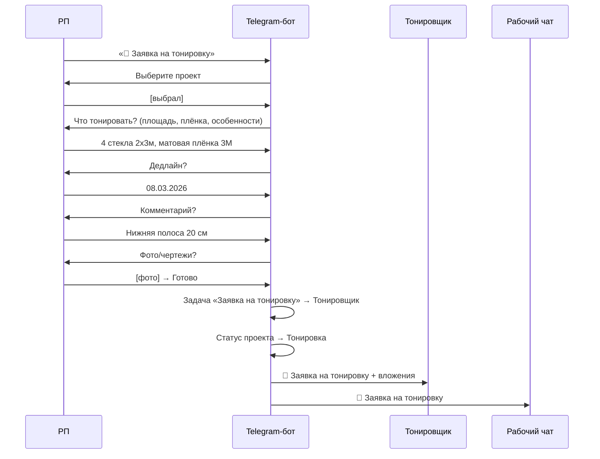
```mermaid
sequenceDiagram
    participant РП as РП
    participant Бот as Telegram-бот
    participant Тон as Тонировщик
    participant Чат as Рабочий чат

    РП->>Бот: «🎨 Заявка на тонировку»
    Бот->>РП: Выберите проект
    РП->>Бот: [выбрал]
    Бот->>РП: Что тонировать? (площадь, плёнка, особенности)
    РП->>Бот: 4 стекла 2x3м, матовая плёнка 3M
    Бот->>РП: Дедлайн?
    РП->>Бот: 08.03.2026
    Бот->>РП: Комментарий?
    РП->>Бот: Нижняя полоса 20 см
    Бот->>РП: Фото/чертежи?
    РП->>Бот: [фото] → Готово

    Бот->>Бот: Задача «Заявка на тонировку» → Тонировщик
    Бот->>Бот: Статус проекта → Тонировка
    Бот->>Тон: 🎨 Заявка на тонировку + вложения
    Бот->>Чат: 🎨 Заявка на тонировку
```

**Создаётся:** Задача «Заявка на тонировку» (назначена Тонировщику).
**Обновляется:** Проект → «Тонировка».

---

### 3.5 Просмотр задач и проектов

| Триггер | Описание |
|---------|----------|
| «📥 Входящие задачи» | Задачи РП («Запрос документов», «Запрос КП», «Проблема» и др.) |
| «🗂 Проекты» | Все недавние проекты (до 20) |
| «📌 Поиск проекта» | Поиск проекта по тексту |

---

## 4. ТД — Технический директор

Роль: «ТД» | Сергей (технический директор).

### 4.1 Подтверждение оплаты

**Триггер:** Кнопка «✅ Подтверждение оплат» или встроенные кнопки в задаче

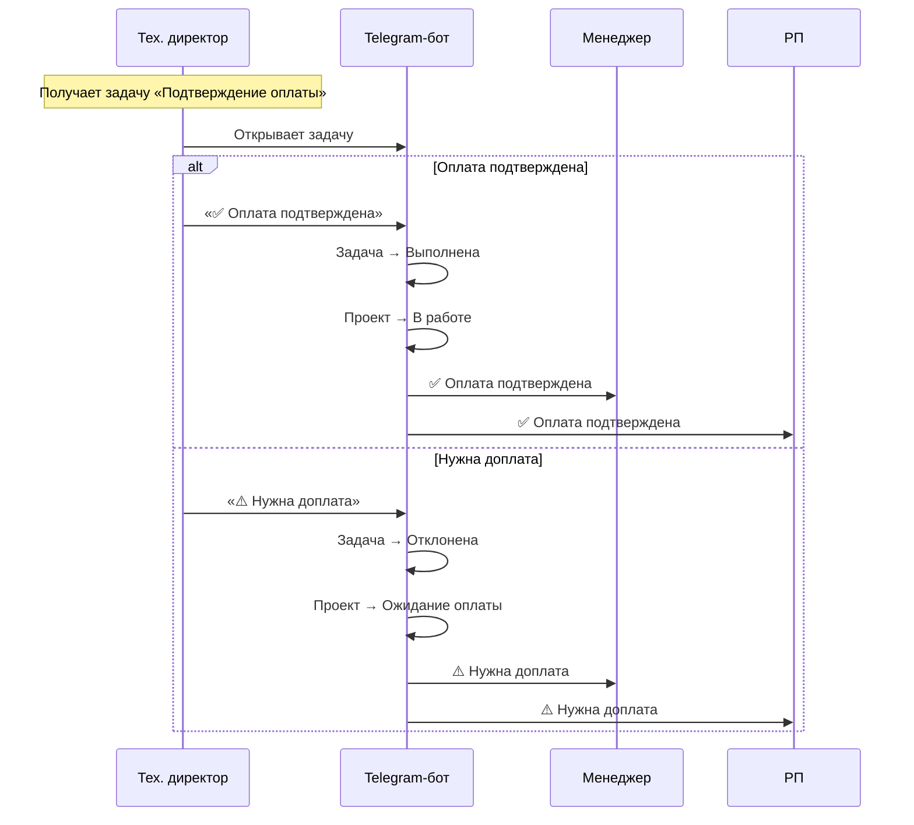
```mermaid
sequenceDiagram
    participant ТД as Тех. директор
    participant Бот as Telegram-бот
    participant М as Менеджер
    participant РП as РП

    Note over ТД: Получает задачу «Подтверждение оплаты»
    ТД->>Бот: Открывает задачу
    alt Оплата подтверждена
        ТД->>Бот: «✅ Оплата подтверждена»
        Бот->>Бот: Задача → Выполнена
        Бот->>Бот: Проект → В работе
        Бот->>М: ✅ Оплата подтверждена
        Бот->>РП: ✅ Оплата подтверждена
    else Нужна доплата
        ТД->>Бот: «⚠️ Нужна доплата»
        Бот->>Бот: Задача → Отклонена
        Бот->>Бот: Проект → Ожидание оплаты
        Бот->>М: ⚠️ Нужна доплата
        Бот->>РП: ⚠️ Нужна доплата
    end
```

---

### 4.2 Оплата поставщику

**Триггер:** Кнопка «💸 Оплата поставщику»

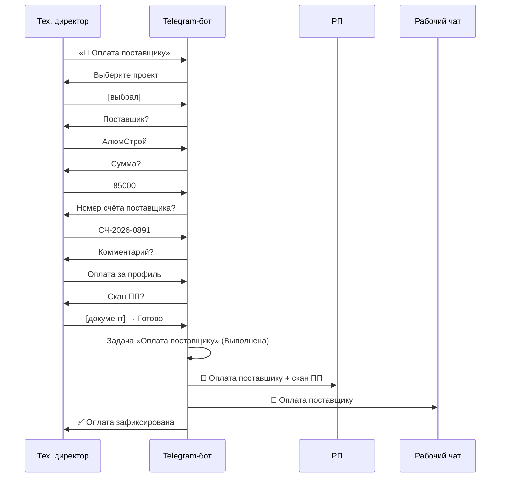
```mermaid
sequenceDiagram
    participant ТД as Тех. директор
    participant Бот as Telegram-бот
    participant РП as РП
    participant Чат as Рабочий чат

    ТД->>Бот: «💸 Оплата поставщику»
    Бот->>ТД: Выберите проект
    ТД->>Бот: [выбрал]
    Бот->>ТД: Поставщик?
    ТД->>Бот: АлюмСтрой
    Бот->>ТД: Сумма?
    ТД->>Бот: 85000
    Бот->>ТД: Номер счёта поставщика?
    ТД->>Бот: СЧ-2026-0891
    Бот->>ТД: Комментарий?
    ТД->>Бот: Оплата за профиль
    Бот->>ТД: Скан ПП?
    ТД->>Бот: [документ] → Готово

    Бот->>Бот: Задача «Оплата поставщику» (Выполнена)
    Бот->>РП: 💸 Оплата поставщику + скан ПП
    Бот->>Чат: 💸 Оплата поставщику
    Бот->>ТД: ✅ Оплата зафиксирована
```

**Создаётся:** Задача «Оплата поставщику» (статус «Выполнена» сразу — это факт оплаты).
**Уведомления:** РП проекта + рабочий чат.

---

### 4.3 Кнопка «💸 Оплатить поставщику» в задаче заказа

При получении задач «Заказ профиля» / «Заказ стекла» / «Заказ материалов» ТД видит дополнительную кнопку «💸 Оплатить поставщику», которая открывает сценарий 4.2 с привязкой к проекту.

---

## 5. Бухгалтерия

Роль: «Бухгалтерия»

### 5.1 Запрос информации от менеджера

**Триггер:** Кнопка «📨 Менеджеру (Имя)»

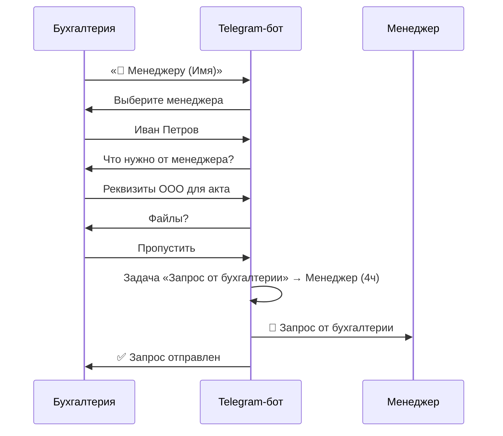
```mermaid
sequenceDiagram
    participant Бух as Бухгалтерия
    participant Бот as Telegram-бот
    participant М as Менеджер

    Бух->>Бот: «📨 Менеджеру (Имя)»
    Бот->>Бух: Выберите менеджера
    Бух->>Бот: Иван Петров
    Бот->>Бух: Что нужно от менеджера?
    Бух->>Бот: Реквизиты ООО для акта
    Бот->>Бух: Файлы?
    Бух->>Бот: Пропустить

    Бот->>Бот: Задача «Запрос от бухгалтерии» → Менеджер (4ч)
    Бот->>М: 📨 Запрос от бухгалтерии
    Бот->>Бух: ✅ Запрос отправлен
```

**Создаётся:** Задача «Запрос от бухгалтерии» (дедлайн 4ч).

---

### 5.2 Просмотр закрывающих

**Триггер:** Кнопка «📄 Закрывающие»

Показывает список задач «Закрывающие документы», назначенных бухгалтеру (статусы Открыта / В работе).

---

## 6. Монтажник

Роль: «Монтажник»

### 6.1 Отчёт за день

**Триггер:** Кнопка «📝 Отчёт за день»

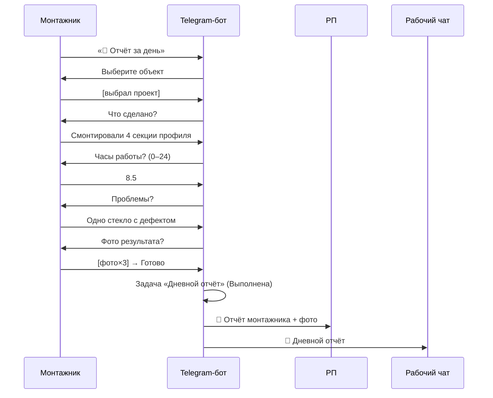
```mermaid
sequenceDiagram
    participant Мон as Монтажник
    participant Бот as Telegram-бот
    participant РП as РП
    participant Чат as Рабочий чат

    Мон->>Бот: «📝 Отчёт за день»
    Бот->>Мон: Выберите объект
    Мон->>Бот: [выбрал проект]
    Бот->>Мон: Что сделано?
    Мон->>Бот: Смонтировали 4 секции профиля
    Бот->>Мон: Часы работы? (0–24)
    Мон->>Бот: 8.5
    Бот->>Мон: Проблемы?
    Мон->>Бот: Одно стекло с дефектом
    Бот->>Мон: Фото результата?
    Мон->>Бот: [фото×3] → Готово

    Бот->>Бот: Задача «Дневной отчёт» (Выполнена)
    Бот->>РП: 📝 Отчёт монтажника + фото
    Бот->>Чат: 📝 Дневной отчёт
```

**Создаётся:** Задача «Дневной отчёт» (статус «Выполнена» сразу).

---

### 6.2 Монтаж завершён

**Триггер:** Кнопка «✅ Счёт ОК»

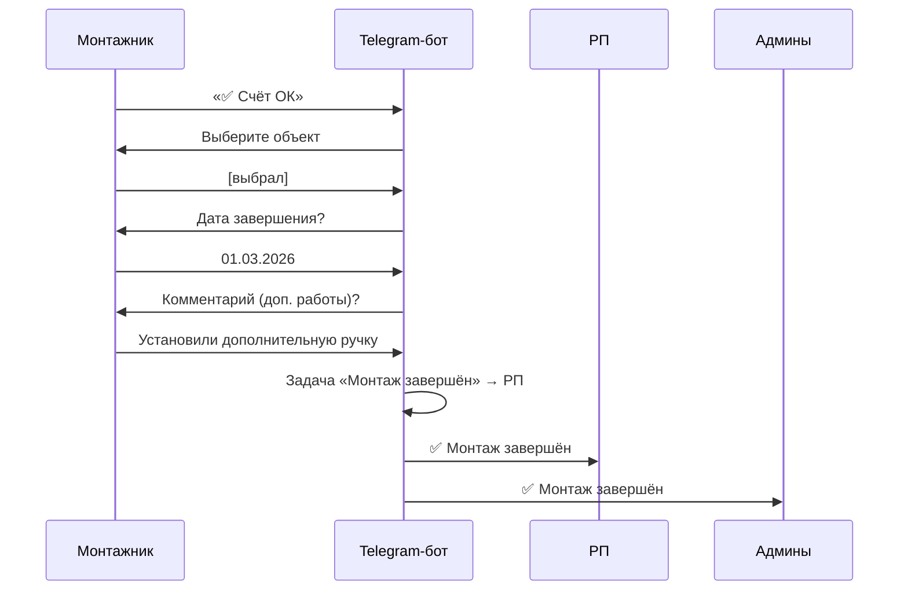
```mermaid
sequenceDiagram
    participant Мон as Монтажник
    participant Бот as Telegram-бот
    participant РП as РП
    participant Адм as Админы

    Мон->>Бот: «✅ Счёт ОК»
    Бот->>Мон: Выберите объект
    Мон->>Бот: [выбрал]
    Бот->>Мон: Дата завершения?
    Мон->>Бот: 01.03.2026
    Бот->>Мон: Комментарий (доп. работы)?
    Мон->>Бот: Установили дополнительную ручку

    Бот->>Бот: Задача «Монтаж завершён» → РП
    Бот->>РП: ✅ Монтаж завершён
    Бот->>Адм: ✅ Монтаж завершён
```

**Создаётся:** Задача «Монтаж завершён».

---

### 6.3 Проблема / простой / дозаказ

**Триггер:** Кнопка «🆘 Проблема / простой»

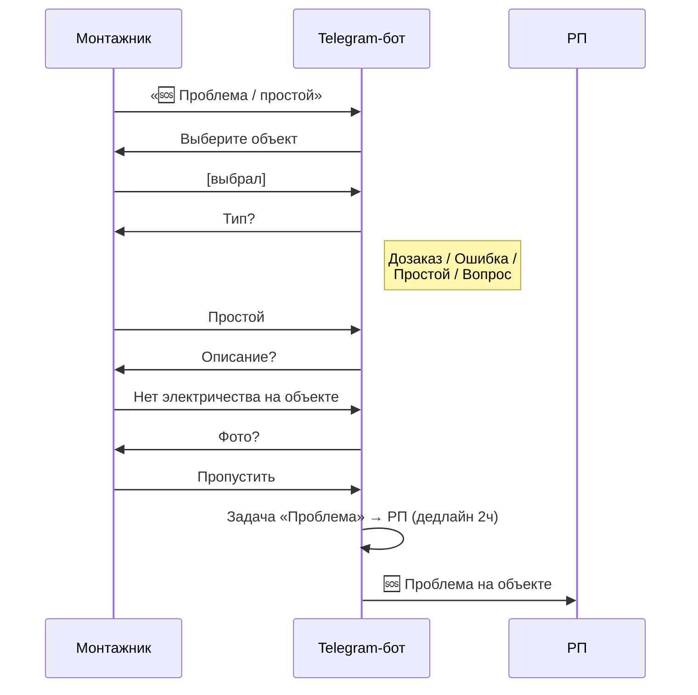
```mermaid
sequenceDiagram
    participant Мон as Монтажник
    participant Бот as Telegram-бот
    participant РП as РП

    Мон->>Бот: «🆘 Проблема / простой»
    Бот->>Мон: Выберите объект
    Мон->>Бот: [выбрал]
    Бот->>Мон: Тип?
    Note right of Бот: Дозаказ / Ошибка /<br/>Простой / Вопрос
    Мон->>Бот: Простой
    Бот->>Мон: Описание?
    Мон->>Бот: Нет электричества на объекте
    Бот->>Мон: Фото?
    Мон->>Бот: Пропустить

    Бот->>Бот: Задача «Проблема» → РП (дедлайн 2ч)
    Бот->>РП: 🆘 Проблема на объекте
```

**Создаётся:** Задача «Проблема» (назначена РП, дедлайн 2ч).

---

## 7. Водитель

Роль: «Водитель»

### 7.1 Доставка выполнена

**Триггер:** Кнопка «✅ Доставка выполнена»

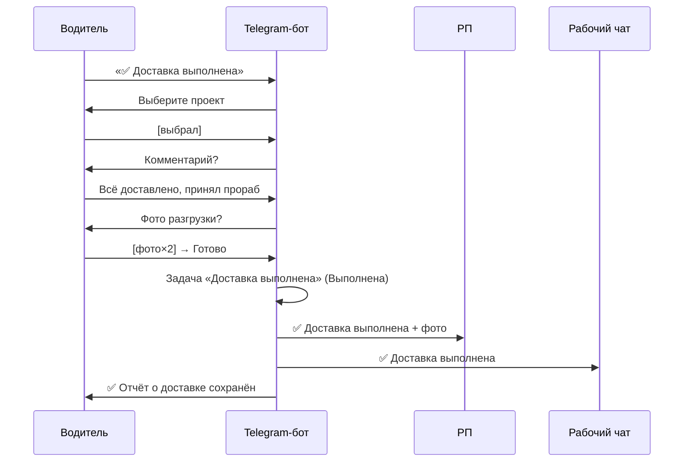
```mermaid
sequenceDiagram
    participant Вод as Водитель
    participant Бот as Telegram-бот
    participant РП as РП
    participant Чат as Рабочий чат

    Вод->>Бот: «✅ Доставка выполнена»
    Бот->>Вод: Выберите проект
    Вод->>Бот: [выбрал]
    Бот->>Вод: Комментарий?
    Вод->>Бот: Всё доставлено, принял прораб
    Бот->>Вод: Фото разгрузки?
    Вод->>Бот: [фото×2] → Готово

    Бот->>Бот: Задача «Доставка выполнена» (Выполнена)
    Бот->>РП: ✅ Доставка выполнена + фото
    Бот->>Чат: ✅ Доставка выполнена
    Бот->>Вод: ✅ Отчёт о доставке сохранён
```

**Создаётся:** Задача «Доставка выполнена» (статус «Выполнена»).

---

## 8. Тонировщик

Роль: «Тонировщик»

### 8.1 Тонировка выполнена

**Триггер:** Кнопка «✅ Тонировка выполнена»

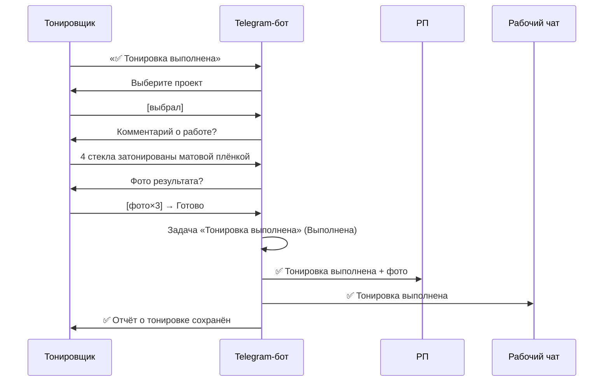
```mermaid
sequenceDiagram
    participant Тон as Тонировщик
    participant Бот as Telegram-бот
    participant РП as РП
    participant Чат as Рабочий чат

    Тон->>Бот: «✅ Тонировка выполнена»
    Бот->>Тон: Выберите проект
    Тон->>Бот: [выбрал]
    Бот->>Тон: Комментарий о работе?
    Тон->>Бот: 4 стекла затонированы матовой плёнкой
    Бот->>Тон: Фото результата?
    Тон->>Бот: [фото×3] → Готово

    Бот->>Бот: Задача «Тонировка выполнена» (Выполнена)
    Бот->>РП: ✅ Тонировка выполнена + фото
    Бот->>Чат: ✅ Тонировка выполнена
    Бот->>Тон: ✅ Отчёт о тонировке сохранён
```

**Создаётся:** Задача «Тонировка выполнена» (статус «Выполнена»).

---

## 9. ГД — Генеральный директор

Роль: «ГД» | Сергей (совмещает с ТД).

ГД получает:

- Все срочные задачи («Срочно ГД»)
- Эскалации невзятых лидов (после 15 мин) — с кнопками назначения менеджеру
- Доступ к поиску проектов и входящим задачам

Основное меню ГД совпадает с меню ТД (т.к. Сергей = ТД + ГД).

---

## 10. Лиды из amoCRM

### 10.1 Автоматическое получение новых лидов

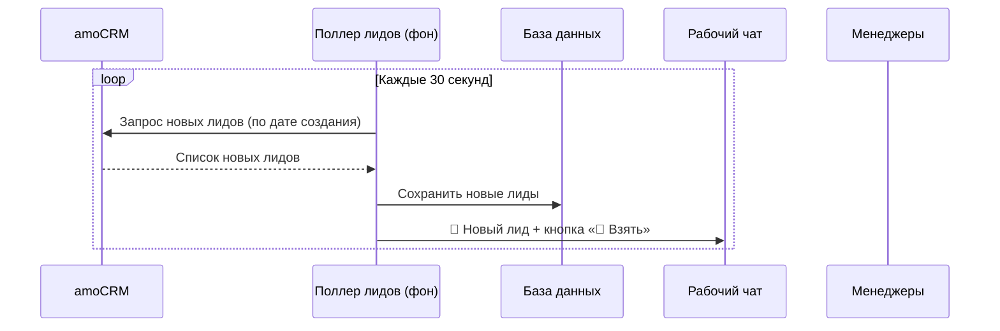
```mermaid
sequenceDiagram
    participant CRM as amoCRM
    participant Поллер as Поллер лидов (фон)
    participant БД as База данных
    participant Чат as Рабочий чат
    participant М as Менеджеры

    loop Каждые 30 секунд
        Поллер->>CRM: Запрос новых лидов (по дате создания)
        CRM-->>Поллер: Список новых лидов
        Поллер->>БД: Сохранить новые лиды
        Поллер->>Чат: 🔔 Новый лид + кнопка «🙋 Взять»
    end
```

---

### 10.2 Взятие лида менеджером

```mermaid
sequenceDiagram
    participant М as Менеджер
    participant Бот as Telegram-бот
    participant БД as База данных
    participant CRM as amoCRM
    participant Чат as Рабочий чат

    М->>Бот: Нажал «🙋 Взять лид в работу» (в чате)
    Бот->>БД: Забрать лид (атомарно)
    alt Успешно
        БД-->>Бот: Успех
        Бот->>Чат: ✅ Лид взят менеджером (кнопка убрана)
        Бот->>CRM: Назначить ответственного менеджера
        Бот->>М: (личное) ✅ Вы взяли лид «Название»
    else Уже взят
        БД-->>Бот: Занят
        Бот->>М: Лид уже взят другим менеджером
    end
```

---

### 10.3 Эскалация невзятого лида (15 мин)

```mermaid
sequenceDiagram
    participant Поллер as Поллер лидов (фон)
    participant БД as База данных
    participant РП as РП
    participant ГД as ГД

    loop Каждые 30 секунд
        Поллер->>БД: Найти неэскалированные лиды (старше 15 мин)
        БД-->>Поллер: Список невзятых лидов
        Поллер->>РП: ⚠️ Лид не взят 15+ мин!<br/>Кнопки выбора менеджера
        Поллер->>ГД: ⚠️ Лид не взят 15+ мин!<br/>Кнопки выбора менеджера
        Поллер->>БД: Пометить лид как эскалированный
    end
```

---

### 10.4 Назначение лида РП/ГД

```mermaid
sequenceDiagram
    participant РП as РП / ГД
    participant Бот as Telegram-бот
    participant М as Менеджер
    participant CRM as amoCRM

    РП->>Бот: Нажал кнопку выбора менеджера (в эскалации)
    Бот->>Бот: Назначить лид менеджеру
    Бот->>Бот: Обновить сообщения в чате
    Бот->>CRM: Назначить ответственного в amoCRM
    Бот->>М: 📋 Вам назначен лид «Название»
```

---

### 10.5 Конвертация лида в проект

```mermaid
flowchart LR
    A[Менеджер взял лид] --> B[Создаёт проект<br/>через «Запрос документов»<br/>или «Запрос КП»]
    B --> C{Есть невыкупленный<br/>лид у менеджера?}
    C -- Да --> D[Лид из amoCRM привязывается<br/>к проекту автоматически]
    C -- Нет --> E[Создаётся новый<br/>лид в amoCRM]
```

---

## 11. Универсальные действия с задачами

Эти кнопки появляются при открытии любой задачи (встроенная клавиатура).

```mermaid
stateDiagram-v2
    state "Открыта" as s1
    state "В работе" as s2
    state "Выполнена" as s3
    state "Отклонена" as s4

    [*] --> s1 : Задача создана
    s1 --> s2 : ⏳ Взять в работу
    s1 --> s4 : ❌ Отклонить
    s2 --> s3 : ✅ Завершить
    s2 --> s4 : ❌ Отклонить

    note right of s1
        Кнопки — Взять / Отклонить
    end note
    note right of s2
        Кнопки — Завершить / Отклонить
    end note
    note right of s3
        Кнопка — Открыть (просмотр)
    end note
    note right of s4
        Кнопка — Открыть (просмотр)
    end note
```

Специальные кнопки для задач типа «Подтверждение оплаты»:

| Кнопка | Действие | Статус задачи | Статус проекта |
|--------|----------|---------------|----------------|
| ✅ Оплата подтверждена | «Оплата ОК» | → Выполнена | → «В работе» |
| ⚠️ Нужна доплата | «Нужна доплата» | → Отклонена | → «Ожидание оплаты» |

Специальная кнопка для задач «Заказ профиля» / «Заказ стекла» / «Заказ материалов»:

| Кнопка | Действие |
|--------|----------|
| 💸 Оплатить поставщику | Переход в сценарий 4.2 (оплата поставщику) |

---

## 12. Фоновые сервисы

### 12.1 Напоминания о дедлайнах

```mermaid
flowchart TD
    A[Цикл напоминаний — каждые 60 сек] --> B{Задача с дедлайном?}
    B -- Нет --> G[Пропустить]
    B -- Да --> C{До дедлайна менее 60 мин?}
    C -- Да --> D["⏰ Скоро дедлайн! → Исполнитель + Чат"]
    C -- Нет --> E{Просрочено более 10 мин?}
    E -- Да --> F["🔴 ПРОСРОЧЕНО! → Исполнитель + Чат"]
    E -- Нет --> G
```

Каждое напоминание отправляется один раз (флаги «скоро дедлайн» и «просрочено»).

---

### 12.2 Синхронизация интеграций

```mermaid
flowchart LR
    A[Создание/обновление<br/>проекта или задачи] --> B[Центр интеграций<br/>очередь событий]
    B --> C[Google Sheets<br/>обновить проект/задачу]
    B --> D[amoCRM<br/>создать лид]
```

---

## 13. Админ-команды

Доступны администраторам бота.

| Команда | Описание |
|---------|----------|
| `/setrole @user role1,role2` | Установить роли пользователю |
| `/addrole @user role` | Добавить роль |
| `/removerole @user role` | Убрать роль |
| `/users` или `/employees` | Список пользователей + управление (роли, блокировка, задачи) |
| `/stats` | Статистика: пользователи, проекты, задачи, активность |
| `/setworkchat chat_id` | Установить рабочий чат для уведомлений |
| `/workchat_test` | Тест отправки в рабочий чат |
| `/resyncsheets` | Пересинхронизация Google Sheets |
| `/setdefaults rp=@user td=@user ...` | Установить исполнителей по умолчанию по ролям |
| `/setsetting key value` | Установить произвольную настройку |

---

## 14. Общие команды

Доступны всем пользователям.

| Команда | Описание |
|---------|----------|
| `/start` | Регистрация / обновление данных, приветствие |
| `/menu` | Показать главное меню (по роли) |
| `/help` | Справка по доступным функциям (по роли) |
| `/id` | Показать свой Telegram ID |
| `/cancel` | Отмена текущего ввода |
| `/search` | Поиск проекта |

---

## Сводная таблица сценариев

| # | Роль | Сценарий | Тип задачи | Назначается |
|---|------|----------|------------|-------------|
| 1 | Менеджер | Запрос документов | «Запрос документов» | РП |
| 2 | Менеджер | Запрос КП | «Запрос КП» | РП |
| 3 | Менеджер | Оплата поступила | «Подтверждение оплаты» | ТД |
| 4 | Менеджер | Закрывающие документы | «Закрывающие документы» | Бухгалтерия |
| 5 | Менеджер | Проблема по проекту | «Проблема» | РП |
| 6 | Менеджер | Завершение проекта | «Завершение проекта» | — |
| 7 | Любая | Срочно ГД | «Срочно ГД» | ГД |
| 8 | РП | Заказ материалов | «Заказ профиля»/«Заказ стекла»/«Заказ материалов» | ТД |
| 9 | РП | Заявка на доставку | «Заявка на доставку» | Водитель |
| 10 | РП | Распределение лида | «Распределение лида» | Менеджер |
| 11 | РП | Заявка на тонировку | «Заявка на тонировку» | Тонировщик |
| 12 | ТД | Подтверждение оплаты | «Подтверждение оплаты» | — (действие) |
| 13 | ТД | Оплата поставщику | «Оплата поставщику» | — (факт) |
| 14 | Бухгалтерия | Запрос менеджеру | «Запрос от бухгалтерии» | Менеджер |
| 15 | Монтажник | Отчёт за день | «Дневной отчёт» | — (факт) |
| 16 | Монтажник | Монтаж завершён | «Монтаж завершён» | РП |
| 17 | Монтажник | Проблема / простой | «Проблема» | РП |
| 18 | Водитель | Доставка выполнена | «Доставка выполнена» | — (факт) |
| 19 | Тонировщик | Тонировка выполнена | «Тонировка выполнена» | — (факт) |
| 20 | amoCRM | Новый лид → взятие | — | Менеджер |
| 21 | amoCRM | Эскалация лида (15 мин) | — | РП / ГД |
| 22 | amoCRM | Лид → проект | — | автопривязка |
